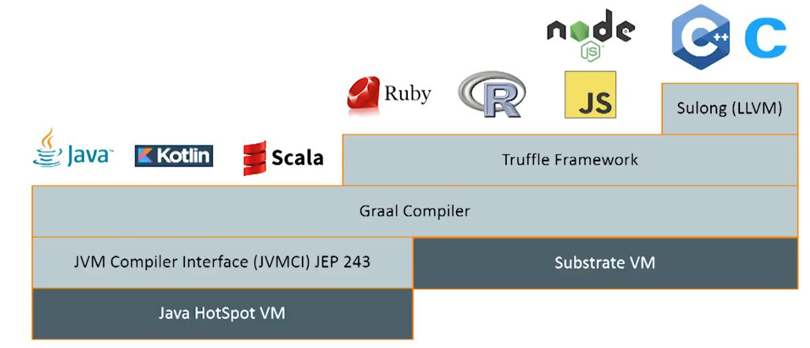

autoscale: true
footer: // Hands on _GraalVM_ -> { created with :heart: and :coffee: by _@LeanderReimer @qaware_ }
slidenumbers: true

[.hide-footer]
[.slidenumbers: false]
# __Hands on__
# [fit] _GraalVM_

---

---

## _GraalVM_ in a Nutshell

- __Polyglot Runtime__: JVM Languages, R, JavaScript, NodeJS, Ruby, Python, C/C++ via LLVM
- __Ahead-of-time Compilation__
  - Memory management, thread scheduling via SubstrateVM
- __GraalVM as a Platform__
  - Embed and extend GraalVM with Truffle
  - Implement your own language and tools

---

# [fit] _Demos_

---

## Build CLIs with _Picocli_ and _GraalVM_

-
